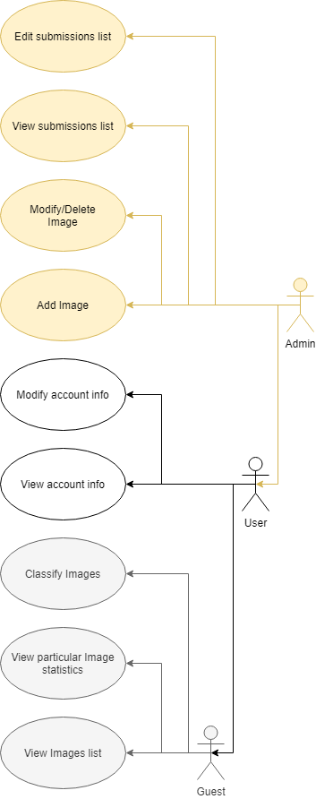

# 1. Overview 

## 1.1 About this document
Our team accepted a commission to create a MNIST image recognition application. We believe that this project can be done in proper way with the tools that we already have and can deliver top notch user interface so it can be good with all ranges of users as it would be.
This document describes the project in detail, including the website's functionality, the team members, their roles and responsibilities, technologies we use in this project, development plans etc.

## 1.2 Project Overview:

The development team uses multiple technologies and software that are described in this document. Furthermore, the Business Requirements, the development phases and goals of this project will be documented here.

The following resources and documents will be used during the development:

- The Functional Requirements of the project

- The features requested by the clients

- The database structure and plan

- The laws and industry standards that this project is subjected

- Regulations

- Terms and conditions

- Cookies

- Logging

- Privacy policies like: advertising policies and third party privacy policies

- CCPA and GDPR data protection rights

Some additional information:

- We are responsible for a website, that allows users to classify MNIST images.

- Show image list.

- Get some statistics for each image.

- Provide a comfortable usage experience.

# 2. Project plan
## 2.1 Roles and responsibilities
### Backend developer:
Backend developers are responsible for developing the server-side code, they create the website's functions, and the data structures. They mainly use PHP codes.

### Frontend developer:
Frontend developers implement the visual elements that users see and interact with in the website. They make sure that users have no trouble navigating the website. They use HTML, CSS, JavaScript codes.

### Database developer:
Database developers are responsible for the storage and management of the data we use in this website. 

## 2.2 Team members

* Ahmed Mahfouz - Frontend developer, Team leader;
* Oleg Dragoi - Database developer, Backend developer
* Yslamguly Pirgulyyev - Junior developer
* Csanádi Balázs Tóbiás - Senior Developer
* Fügedi Csaba - Senior Developer
* Meghwar Om Parkash - Senior Developer
* Kungl Rebeka - Senior Developer
* Ádám Ligárt - Senior Developer

## 2.3 Project schedule

## 2.4 Milestones

## 2.5 Technologies

### Web framework – Bootstap
Bootstap will be used to make the dynamic layout of the webshop, so it works smoothly on all resolutions in the browsers.

### Web server – Apache
An Apache web server will be used to store the database information, in which we will store the database writen in MySQL structure.

### Programming language – PHP
We are going to write our code in PHP, since it is the most used programming language for building websites.

### Communication – Discord, GitHub, Trello
- Discord is a communication software made for voice chat. Since Discord is free we are gonna use this software, because it is not sure that all of us will be in the same room when our company develops the webshop the client asked for. With this we will be able to communicate in real time with our coding partners, and since it has a normal chat function that follows the written messages, it will be easy to trace back with the problems that are brought up during development.

- GitHub is a free repository where the project will be stored during development. With this we can share and retrivel the versions of our work, and if something is not working we can reroll the changes so we don't have to start from the beginning.

- Trello is a free web-based Kanban-style list-making application. We can create our task boards with several columns and move the tasks between them. Typically columns include task statuses: To Do, In Progress and Done.

### Data structure store – MySQL
The database structure will be written in MySQL structure.

Recommended version: Latest Stable

# 3. Business model

# 4. Requirements

## 4.1 Functional Requirements
Using common website elements and user management system:

- Register: The users should have the opportunity to sign up. After registration they will have an own Profile Page.

- Logging in and out: Editors should be able to log in and out.

- Possibility to change password: Users' passwords should be changeable.

- Profile details: Users should be able to see and modify the details on their Profile Page.

Website functions:

- Showing numbers: Users can easily classify the numbers if we show them straight forward.

- Listing items, browsing: The user should be able to look up the images list and filter them on the website.

- Image details: The customer should be able to see each image in a separate page.

## 4.2 Non-functional Requirements

The site must (be):

- Easy to use

- User-friendly

- Able to navigate to the corresponding pages

- Show error messages in different and consistent location and style

- Have control panels, buttons (some of them are hidden from the general users)

- Have permission system

- Fit the EU Privacy Policy requirements

Supported browsers:

- Mozilla Firefox

- Microsoft Edge

- Google Chrome

- Safari

## 4.3 Resources

- Fully functional database with tables and relations

- Secured connection

- Intuitive/easy to use interface

- Creative front-end palette

- Based on MySQL and PHP

# 5. Functions

## 5.1 Participants

This website has three user level:

- Guest

- User

- Admin

## 5.2 Use cases and scenarios

### Guest:
- Able to see the images list.
- Able to see image statistics.

### User:
- Has all the guest privileges.
- Able to choose input.
- Able to see their score.
- Able to skip to next image or number if they can't understand current one.

### Admin:
- Has all the user privileges.
- See the user input.
- Categorize each result based on the numbers.
- Can remove numbers from the database.

# 6. Physical environments
This application was made for web platform and should be used with the supported web browsers.

**Software and external systems we're working with:**
- Sublime Text Editor (for PHP)
- Gitkraken/Github for documentation
- Trello
- Visual Studio Code
- Discord
- Markdown Monster
- app.diagrams.net

**Hardware and Network:**
- General hardware and network requirements

**Development tools:**
- Visual Studio Code
- Sublime Text Editor

**Technologies:**
- Bootstrap: Web framework, it is used to make the dynamic layout of the website. It works well with different resolutions and browsers.
- Apache: The Apache web server is used to store, process and deliver the webpage to the browsers.
- PHPMyAdmin: Administration tool for MySQL and MariaDB database server, where we store the data of our website, including editors account data and the articles.
- MySQL: The database structure will be implemented according to MySQL standards.
- PHP: The websties code will be implemented in PHP, which is the most popular way of building website.

# 7. Architecture plan
## 7.1 Backend
The system needs a database system, in this case the team uses a Visual Studio based client, where we store the user's data and the products. Web Client: The client is based on PHP technologies, which helps the client to be stable. On the other hand we can create creative and spectacular content for our users. Furthermore, it will be used to create the website's functions, handle user data and statistical content.

## 7.2 Frontend
The frontend uses CSS, HTML and JavaScript codes and using Bootstrap as its framework, which helps to create a modern looking website and works well cross-platform.

# 8. Database plan

## 8.1 Tables

### Users

# 9. Implementation plan
